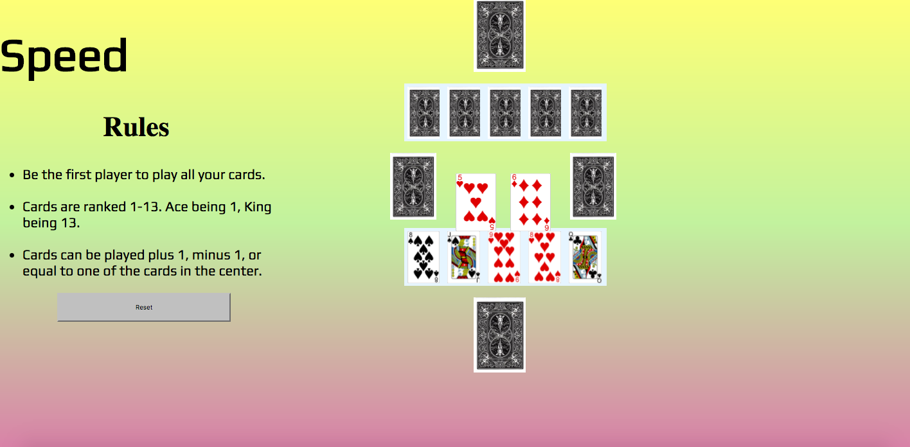

# speed-project

https://erikr93.github.io/speed-project/

## Description
Speed is a game involving one player and a computer player. The object is to be the first player to run out of cards in their deck. Cards are ranked 1-13 and you're able to play 1 up, 1 down, or 1 equal to one of the two cards in the middle of the gameboard.  Upon either player winning the game I have set up a reset button so you can play again.

## Issues I ran into
It took me a really long time to get the images and the rank of the card to move together. Everytime I got one step close a major bug would occur and it was just a matter of fixing all the bugs for both the player and the computer player. That is what I spent most of my time doing on this project.

## Next steps
My next step as of right now is to incorporate the win function and display an alert as to which player won. I was having a hard time figuring out how to tell when the player deck was exhausted. Another step I need to complete is to make the "help cards" function. They are what will go onto the center cards if neiter player can make a move. With that I was having a hard time thinking of a way to tell the computer that neither player could make a move. There are still a few bugs involving placing cards I would like to fix and making the image of the card disappear when the hand starts running out of cards.

## Acknowledgements
Fisher-Yates shuffle algorithm